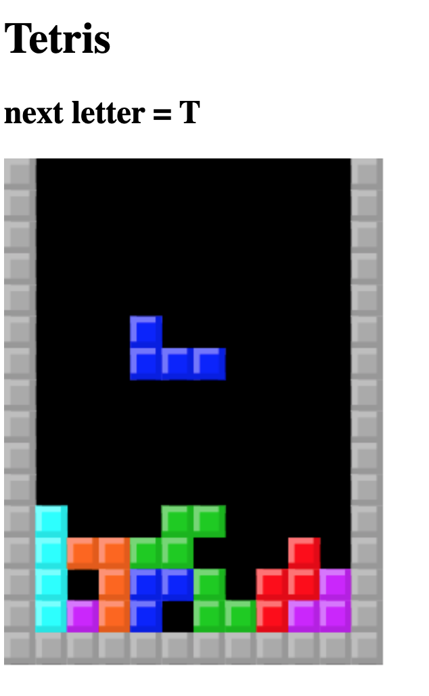

# Tetris JS implementation

## how to run
- install 'browserify' and 'http-server' via npm & node.js
- browserify index.js > bundle.js (run this command in project folder root)
- http-server ./ -c-1 (run this command in project folder root)

